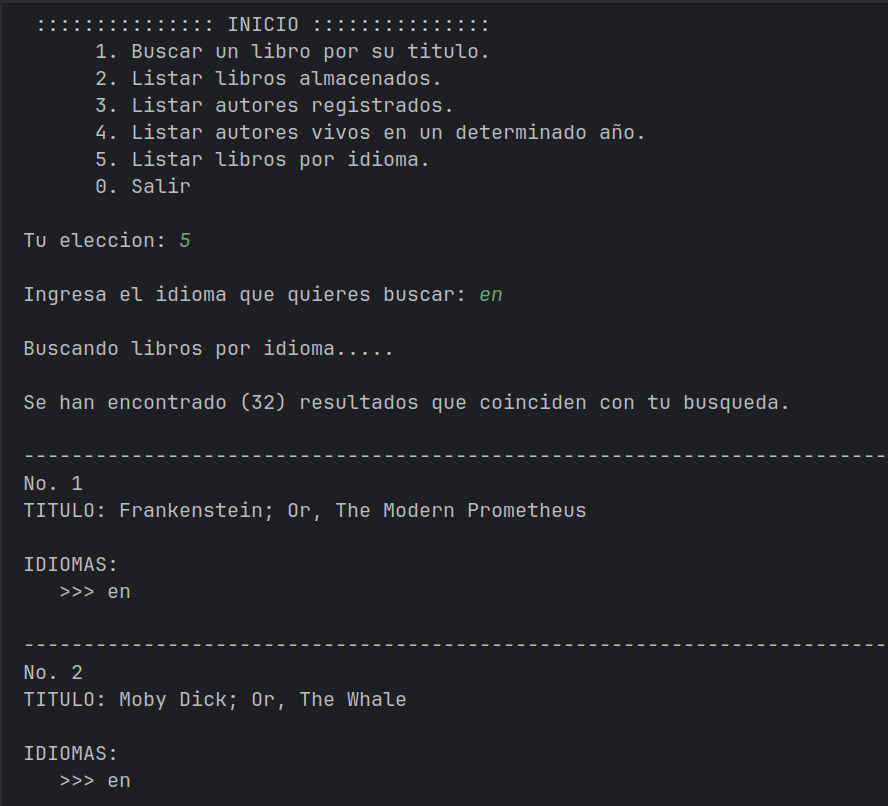

<h1 align="center"> LiterAlura </h1>

- Arquitectura:

 
 
- Inicio de la aplicacion:

## Descripcion:
Esta es una aplicación desarrollada en Java con Spring Boot que permite
la búsqueda y gestión de libros mediante el consumo de la API 
de https://gutendex.com/ con persistencia de datos en PostgreSQL.

La aplicacion almacena de forma automatica cada consulta que realice
el usuario sobre un libro y tiene opciones donde podemos consultar 
sobre estos datos almacenados, realizar filtros por idioma o una fecha
en especifico.

- Consultas a la base de datos:

   
   
- Filtrado de datos:

La persistencia de datos en esta aplicación se gestiona mediante
Spring Data JPA, con un diseño en capas que sigue el patrón de 
repositorio.